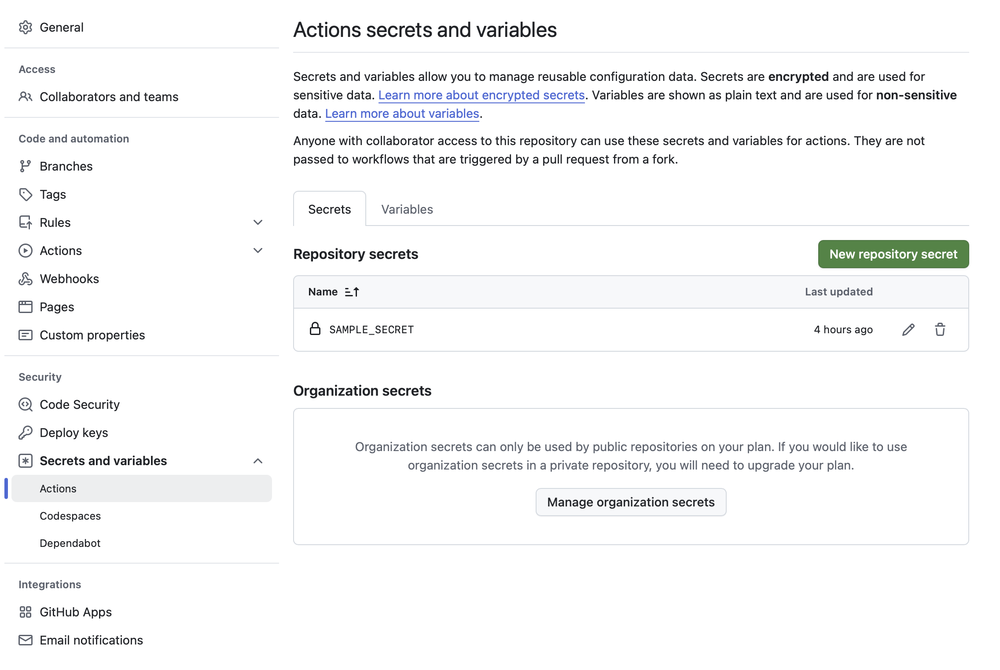

<br/>
<div align="center">
  <a href="https://daklabb.dev">
    <picture>
      
    </picture>
  </a>
</div>
<br/>

# Overview

GitHub Actions are both powerful and broadly accessible. With minimal effort and little/no cost, you can build out a robust CI/CD pipeline that is versioned along with your code and smoothly integrated with your release process. That said, the [GitHub provided documentation](https://docs.github.com/en/actions) leaves something to be desired. The goal of this project is to provide helpful docs/examples to allow those new to GH actions (or those like myself who get rusty between projects) to hit the ground running and build out effective workflows quickly. While my goal is to make these docs as complete as possible, feel free to reach out to me vai email (david@daklabb.dev) if you have a question not answered here or would like to engage me to help you build out your CI/CD pipelines.

# Creating a workflow
To add a GH workflow to your repo, simplly create a `.gihub` directory at the root of your poject, and within this, create a `workflows` directory. You can then create yaml files in this directory to define your repo's workflows. For the smiple "hello world" style workflow discussed below, I have created [ci.yaml](/.github/workflows/ci.yaml) in this repo.

## Triggers
There are [lots of ways](https://docs.github.com/en/actions/writing-workflows/choosing-when-your-workflow-runs/triggering-a-workflow) to trigger GH actions, but the 5 I use most often are:
- PR Sync: run the CI when a PR is opened/updated against a specific branch
- Brnach Push: run when code is pushed to a particular branch
- Tag Publish: run when a tag is created in the repo
- Cron: run on a schedule
- Manual: run whenever manually triggered

Triggers live in the [on](https://github.com/DAKLabb/gh-actions/blob/main/.github/workflows/ci.yaml?plain=1#L3) stanza.

### PR Sync
One of my key goals in adding workflows to a project is to maintain code quality. I may want to enfoce style conventions with a linter, or perhaps run unit tests, or even just make sure my code builds. Generally, the goal will be that the `main` branch is stable/correct, and I will want to make sure that any PRs run checks before allowing code to be merged in. Note: Adding [branch protection rules] allows us to actually enforce this.

While there are a number of `pull_request` triggers, I tend to focus on those targeting specfiic `branches`. In [this]((https://github.com/DAKLabb/gh-actions/blob/main/.github/workflows/ci.yaml?plain=1#L4-L8)) example, I trigger the CI on any PR targeting any of my key branches (`main`, `staging`, `dev`).

```yaml
on:
  pull_request:
    branches:
      - main
      - staging
      - dev
```

### Branch Push
In addition to having CI that protects prod/staging/dev branchs by running workflows on PRs, you may also want to have CI that runs on pushes to particular branches. For example, if you have environments that you deploy your various builds to (main branch -> production, staging branch -> staging, dev branch -> develop) you may want to trigger CI to update those deployments when you push to a particular branch.

In [this]((https://github.com/DAKLabb/gh-actions/blob/main/.github/workflows/ci.yaml?plain=1#L9-L13)) example, I trigger the CI on pushes to any of my key branches (`main`, `staging`, `dev`).

```yaml
on:
  push:
    branches:
      - main
      - staging
      - dev
```

### Tag Publish
As with pushes to branches, you can also trigger a workflow when a tag is pushed. Lets say I want to publish my python SDK every time I create a semantically versioned tag in my repo. I could do something like [this](https://github.com/DAKLabb/gh-actions/blob/main/.github/workflows/ci.yaml?plain=1#L14-L15) and push to pypi every time a new tag matchign my naming convention is pushed to my repo.

```yaml
on:
  push:
    tags:
      - 'v[0-9]+.[0-9]+.[0-9]+'
```

### Cron
When managing client code, I like to write regression tests that run against the production system it is designed to interact with. This is a great use-case for cron-based CI jobs. [This](https://github.com/DAKLabb/gh-actions/blob/main/.github/workflows/ci.yaml?plain=1#L16-L17) example will run my CI job ever day at 6am GMT. The benefit of jobs like this is that they can detect issue before work hours to alert you to issues before your users find them.

```yaml
on:
  schedule:
    - cron: "0 6 * * *"
```

### Manual
If you are reading this, you may have tried developing GH actoins before and come to the conclusion that they are a pain to test. This is a fact, but one method that can make life a bit easier is to add a [manual trigger](https://github.com/DAKLabb/gh-actions/blob/main/.github/workflows/ci.yaml?plain=1#L18-L23) to your workflow. This allows you to trigger it ad-hoc for testing. It can also be useful for ad-hoc integration tests or other useful workflows discussed in more details in a [later]()s secion.

```yaml
on:
  workflow_dispatch:
```

## Inputs

## Environment & Secrets
Within the workflow/actions you can create env variables using `env`. This can be done at the [workflow level](https://github.com/DAKLabb/gh-actions/blob/main/.github/workflows/ci.yaml?plain=1#L25-L27), at the [job level](https://github.com/DAKLabb/gh-actions/blob/main/.github/workflows/ci.yaml?plain=1#L33-L34), or at the [step level](https://github.com/DAKLabb/gh-actions/blob/main/.github/workflows/ci.yaml?plain=1#L47-L48). These can be hardcoded values, but they can also be templated from the action context (more on this [later](https://github.com/DAKLabb/gh-actions?tab=readme-ov-file#workflow-context)) or from repo secrets (see screenshot below).



## Jobs/Steps
A workflow is made up of a series of jobs, and jobs are composed of steps. If the `needs` and `if` field of jobs are left blank, they will all run at the same time (as is the case [here](https://github.com/DAKLabb/gh-actions/actions/runs/14930654481) for [jobs](https://github.com/DAKLabb/gh-actions/blob/main/.github/workflows/ci.yaml?plain=1#L30-L56) `hello-world` and `hello-again`).

### Conditional Execution
Sometimes you don't want all your jobs to run at the same time. Perhaps you create assets in one step that you need in a later one, or perhaps you have a long step that you don't run to run on all pushes.

#### Other Jobs
If you don't want to run a job until and earlier one succeeds, you can use the [needs](https://github.com/DAKLabb/gh-actions/blob/main/.github/workflows/ci.yaml?plain=1#L59) field to only run the job once the named job(s) have succeded. The example below will only run job 3 once jobs 1 and 2 have passed.

```yaml
job3:
  needs:
    - job1
    - job2
```

#### Basic Logic
You may also want to only run a job or step under certain conditions. In [this](https://github.com/DAKLabb/gh-actions/blob/main/.github/workflows/ci.yaml?plain=1#L60) example, "conditional-job" is only run when the workflow is triggered manually. Similarly, the [optional step](https://github.com/DAKLabb/gh-actions/blob/main/.github/workflows/ci.yaml?plain=1#L64-L66) only runs if the [input](https://github.com/DAKLabb/gh-actions?tab=readme-ov-file#inputs) is set to true.

```yaml
conditional-job:
  needs: hello-world
  if: ${{ github.event_name == 'workflow_dispatch' }}
  runs-on: ubuntu-latest
  steps:
    - uses: actions/checkout@v4
    - name: optional step
      if: ${{ github.event.inputs.dump_context == 'true' }}
```

### Using Opensource Steps
In addion to writing your on GH actions, you can use public open source ones. In the example above, you can see me using the `checkout` action to checkout my project. Below are some that I use frequently, but there are a lot out there. As with any other time you are using someone else's code, be catious, especially if the job takes in any secrets.

| Action                                                     | Description                                                            |
|------------------------------------------------------------|------------------------------------------------------------------------|
| [actions/checkout@v4](https://github.com/actions/checkout) | This action checks-out your repository so your workflow can access it. |
| [actions/setup-python@v5](https://github.com/actions/setup-python) | This is used to setup python, but there are a number of other `setup` actions [available from GitHub](https://github.com/actions?q=setup&type=all&language=&sort=stargazers) as well as other developers. |
| [upload](https://github.com/actions/upload-artifact) and [download](https://github.com/actions/download-artifact) artifacts | Upload/Download [Actions Artifacts](https://docs.github.com/en/actions/using-workflows/storing-workflow-data-as-artifacts) from your Workflow Runs. More information and examples [below](https://github.com/DAKLabb/gh-actions?tab=readme-ov-file#artifacts). |
| [actions/cache@v4](https://github.com/actions/cache) | This action allows caching dependencies and build outputs to improve workflow execution time. More information and examples [below](https://github.com/DAKLabb/gh-actions?tab=readme-ov-file#caching). |

#### Action versioning
As you can see in the table above, I am referening specific versoins of those actions (i.e. `actions/checkout@v4`). It is a good idea to periodically review all external actions and migrate to newer versions as they are released.

## Useful info
### [skip ci]
When adding a commit and pushing to you may want to skip running CI. Maybe it is too long, maybe it is costly, maybe the commit is a work in progress and is going to fail CI. As documented by [GitHub](https://docs.github.com/en/actions/managing-workflow-runs-and-deployments/managing-workflow-runs/skipping-workflow-runs) you can easily skip using any of the following commit messages: `[skip ci]`, `[ci skip]`, `[no ci]`, `[skip actions]`, `[actions skip]`

# Example Workflows/Actions
Below are some example workflows/actions that might be useful. As with anything, this is just one way of doing things.

## Retry
Unfortunatly, GitHub doesn't expose an easy mechanism for retrying failling actions/workflows/jobs. After encoutering this issue recnetly, I decided to document the solution I went with [here](https://github.com/DAKLabb/retry).

## Link Checking
Nothing makes a website seem more defunct than a bunch of dead links. That said, when you are moving fast, it can be a headache to keep on top of changes, and downright impossible to stay on top of links to external sites that end up restructuring. There are already great tools out there to solve this problem, and this uses one of them ([linkchecker](https://github.com/linkchecker/linkchecker)) to run checks via GH actions in a simple and easy to customize way. More information can be found in the action's repo [here](https://github.com/DAKLabb/check-links).

For a quick example implementation, see the [link-checking.yaml](https://github.com/DAKLabb/gh-actions/blob/main/.github/workflows/link-checking.yaml) workflow running [here](https://github.com/DAKLabb/gh-actions/actions/workflows/link-checking.yaml).

# Note: 
This repo is a work in progress. I intend to continue adding to this as my schedule allows. Please consider opening issues or messaging me (`david@daklabb.dev`) if there is anything you would like to see me add.
